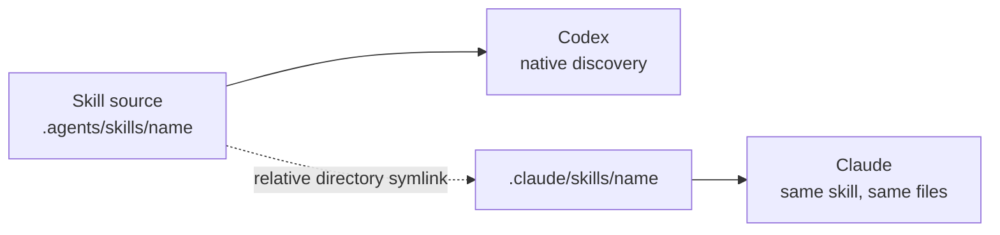

# Agent Skills

> Portable, client-neutral workflows that give coding agents repeatable ways to handle specialized tasks.

Each skill is a small, reviewable package centered on `SKILL.md`. Install only the skills you need, keep their source under `.agents/skills`, and expose the same source to Claude through a relative symlink—no duplicated maintenance.

## Skill catalog

| Skill | What it helps with | Source |
| --- | --- | --- |
| **Beautify GitHub Repository** | Audit and polish a repository, especially its README, using restrained visuals and community-standard quality tools. | [`beautify-github-repo`](./.agents/skills/beautify-github-repo/) |
| **Portable Task Handoff** | Transfer unfinished work safely between sessions, machines, Codex, and Claude Code. | [`handoff`](./handoff/) |

Every source directory contains the agent-facing workflow and may include focused references, scripts, assets, or tests.

## How sharing works



Codex reads the source directory directly. Claude follows one relative directory symlink to that same source, so edits and validation stay synchronized.

## Install a skill in a project

Review the skill's `SKILL.md` before installing it. Then run the following from the target project root, replacing the source and name as needed:

```sh
SKILL=handoff
SOURCE=/path/to/skills/handoff

mkdir -p ".agents/skills" ".claude/skills"
cp -R "$SOURCE" ".agents/skills/$SKILL"
ln -s "../../.agents/skills/$SKILL" ".claude/skills/$SKILL"
```

For `beautify-github-repo`, use `/path/to/skills/.agents/skills/beautify-github-repo` as `SOURCE`. Before replacing an installation or symlink, inspect it and confirm that it belongs to the intended skill.

For a global installation, use `~/.agents/skills` and `~/.claude/skills` instead. Keep the same relative link shape:

```sh
ln -s "../../.agents/skills/$SKILL" "$HOME/.claude/skills/$SKILL"
```

## Repository anatomy

```text
<skill-source>/
├── SKILL.md          # Trigger metadata and core agent workflow
├── agents/           # Optional client-facing metadata
├── references/       # Detailed guidance loaded only when needed
├── scripts/          # Optional deterministic tooling
├── assets/           # Optional reusable output resources
└── tests/            # Tests for bundled tooling
```

## Validate changes

Run each skill's relevant tests after editing it. For the handoff scripts:

```sh
python3 -m unittest discover -s handoff/tests -v
```

Also check skill metadata, Markdown links, referenced assets, and relative Claude symlinks before publishing.

## Conventions

- Keep skills client-neutral unless a workflow explicitly targets one client.
- Keep `SKILL.md` concise; move detailed procedures and catalogs into `references/`.
- Never store secrets, machine-specific artifacts, virtual environments, or generated test output.
- Link individual Claude skill directories only; never replace the entire `.claude/skills` directory.
- Use relative symlink targets so installations remain portable across machines and operating systems.
