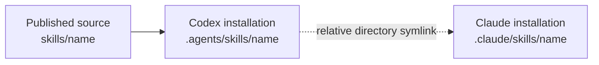

# Agent Skills

> Portable, client-neutral workflows that give coding agents repeatable ways to
> handle specialized tasks.

This repository publishes reviewable skill source packages. Each package lives
at the repository root and is centered on `SKILL.md`; local runtime and
installation directories such as `.agents/` and `.claude/` are deliberately not
part of the repository.

## Skill catalog

| Skill | What it helps with |
| --- | --- |
| [**Beautify GitHub Repository**](./beautify-github-repo/) | Audit and polish a repository, especially its README, with restrained visuals and community-standard quality tools. |
| [**Portable Task Handoff**](./handoff/) | Transfer unfinished work safely between sessions, machines, Codex, and Claude Code. |

## Source and installation

The GitHub repository contains only the distributable source. Install a selected
skill into the environment where an agent will use it:



Codex reads the installed source from `.agents/skills`. Claude follows one
relative directory symlink to the same source, avoiding duplicate maintenance.
The installation directories belong to the consuming environment, not this
source repository.

## Install a skill in a project

Review the skill's `SKILL.md` first. Then run the following from the target
project root, replacing the skill name and source path as needed:

```sh
SKILL=handoff
SOURCE=/path/to/skills/$SKILL

mkdir -p ".agents/skills" ".claude/skills"
cp -R "$SOURCE" ".agents/skills/$SKILL"
ln -s "../../.agents/skills/$SKILL" ".claude/skills/$SKILL"
```

Before replacing an existing installation or symlink, inspect it and confirm
that it belongs to the intended skill.

For a global installation, copy the source to `~/.agents/skills` and create the
matching relative Claude link:

```sh
SKILL=handoff
SOURCE=/path/to/skills/$SKILL

mkdir -p "$HOME/.agents/skills" "$HOME/.claude/skills"
cp -R "$SOURCE" "$HOME/.agents/skills/$SKILL"
ln -s "../../.agents/skills/$SKILL" "$HOME/.claude/skills/$SKILL"
```

## Skill anatomy

```text
<skill-name>/
├── SKILL.md          # Trigger metadata and core agent workflow
├── agents/           # Optional client-facing metadata
├── references/       # Detailed guidance loaded only when needed
├── scripts/          # Optional deterministic tooling
├── assets/           # Optional reusable output resources
└── tests/             # Tests for bundled tooling
```

Only `SKILL.md` is required. Include optional directories when they directly
support the skill.

## Validate changes

Run each skill's relevant tests after editing it. For the handoff scripts:

```sh
python3 -m unittest discover -s handoff/tests -v
```

Also validate skill metadata, Markdown links, referenced assets, and any bundled
scripts. Confirm that the Git tree does not contain `.agents/` or `.claude/`
before publishing.

## Conventions

- Keep skills client-neutral unless a workflow explicitly targets one client.
- Keep `SKILL.md` concise; move detailed procedures and catalogs into
  `references/`.
- Never store secrets, machine-specific artifacts, virtual environments, or
  generated test output.
- Keep runtime configuration and installed skill copies outside this repository.
